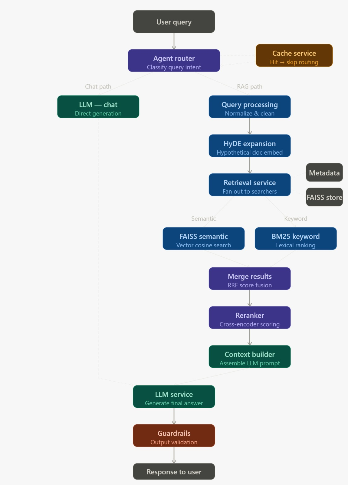

# Agentic RAG System with Dynamic Document Ingestion

A production-oriented Retrieval-Augmented Generation (RAG) system that enables users to upload documents (PDF/TXT) and query them using an intelligent, controlled agent pipeline.

This system is designed with a focus on:
- Low-latency retrieval
- Dynamic document ingestion
- Controlled agentic workflows (no uncontrolled loops)
- Robust caching and guardrails
- Scalable backend deployment

---

## Key Features

- **Dynamic Document Ingestion**  
  Upload up to 5 documents (PDF/TXT) and process them in real-time.

- **Hybrid Retrieval Pipeline**  
  Semantic search powered by embeddings + FAISS vector store.

- **Agentic Query Handling**  
  Controlled routing logic for validation, retrieval, reranking, and generation.

- **Caching Layer**  
  Reduces redundant computation and improves response time.

- **Guardrails**  
  Input validation and safe output handling.

- **Modular Architecture**  
  Clean separation of services (retrieval, reranking, LLM, caching, etc.)

- **Full Stack Deployment**  
  FastAPI backend + HTML/CSS/JS frontend deployed on cloud infrastructure.

---

## Tech Stack

### Backend
- FastAPI
- FAISS (Vector Store)
- OpenAI Embeddings
- Groq LLaMA (LLM inference)
- Python

### Frontend
- HTML
- CSS
- JavaScript (Fetch API)

### Infrastructure
- AWS EC2
- Docker
- Nginx (Reverse Proxy)

---

## How It Works (High-Level)

User Query → Guardrails → Preprocessing → Cache Check → Retrieval → Reranking → Context Building → LLM → Response

---

## System Architecture

The system follows a modular, production-oriented architecture with a controlled agentic workflow. Each stage in the pipeline is explicitly managed to ensure reliability, low latency, and scalability.

### End-to-End Flow

1. User submits a query from the frontend
2. Input is validated using guardrails
3. Query is preprocessed (cleaning, normalization)
4. Cache is checked to avoid redundant computation
5. Relevant documents are retrieved using FAISS
6. Retrieved documents are re-ranked for relevance
7. Context is constructed from top-ranked chunks
8. LLM generates the final answer
9. Response is cached and returned to the user

---

### Agentic Workflow Diagram




---

## Project Structure

The project is organized into a modular structure separating backend, frontend, and deployment configurations.


```
project_root/
│
├── backend/
│   ├── app/
│   │   ├── api/            # API routes (/query, /ingest, /health)
│   │   ├── services/       # Core business logic (RAG pipeline)
│   │   ├── db/             # FAISS and metadata storage
│   │   ├── core/           # Config and startup logic
│   │   ├── models/         # Request/response schemas
│   │   ├── dependencies/   # Shared resources (models, cache)
│   │   ├── utils/          # Helper functions
│   │   └── main.py         # FastAPI entry point
│   │
│   ├── scripts/            # CLI scripts (ingestion, indexing)
│   ├── data/               # Documents, FAISS index, metadata
│   └── requirements.txt
│
├── frontend/
│   ├── index.html          # Entry UI
│   ├── chat.html           # Chat interface
│   ├── js/                 # API calls + UI logic
│   └── css/                # Styling
│
├── docker/                 # Docker configuration
├── nginx/                  # Reverse proxy config
└── README.md
```


---

## Deployment

The application is deployed using **Railway**, enabling quick and reliable cloud deployment of the FastAPI backend.

---

### Live Application

👉 **Chat UI:**  
`https://agenticrag-production-70ce.up.railway.app/chat`

---

### Deployment Setup

The backend is containerized and deployed on Railway with the following configuration:

- FastAPI application served via Gunicorn
- Environment variables managed through Railway dashboard
- Automatic deployment on Git push

---

### Backend Deployment Flow

1. Push code to GitHub  
2. Connect repository to Railway  
3. Configure start command:

```bash
gunicorn -w 2 -k uvicorn.workers.UvicornWorker app.main:app
```


---

## Conclusion

This project demonstrates a production-oriented implementation of a Retrieval-Augmented Generation (RAG) system with a controlled agentic workflow.

Unlike naive RAG pipelines, this system introduces:

- Structured query processing
- Controlled execution flow (agent router)
- Multi-stage retrieval and reranking
- Caching for latency optimization
- Guardrails for safe and reliable interaction

The system is designed to balance **accuracy, performance, and scalability**, making it suitable for real-world applications involving dynamic document querying.

---

## Future Improvements

The current system is designed for demonstration and low-scale usage. The following enhancements can further improve performance and scalability:

### Retrieval Enhancements
- Hybrid retrieval (BM25 + vector search)
- Advanced reranking using cross-encoders
- Query expansion and semantic rewriting

---

### Performance Optimization
- Redis-based distributed caching
- Batch embedding for ingestion
- Asynchronous processing pipelines

---

### Model Improvements
- Fine-tuned embedding models
- Domain-specific LLM tuning
- Better hallucination detection

---

### Scalability
- Replace FAISS with managed vector databases (Pinecone, Weaviate)
- Deploy using container orchestration (Kubernetes)
- Load balancing for high-traffic scenarios

---

### Reliability & Safety
- Advanced guardrails for prompt injection
- Output verification mechanisms
- Monitoring and logging systems

---

## Final Note

This project focuses on building a **reliable and controlled AI system**, rather than just integrating an LLM. The architecture is designed to be extensible and adaptable for real-world use cases.


